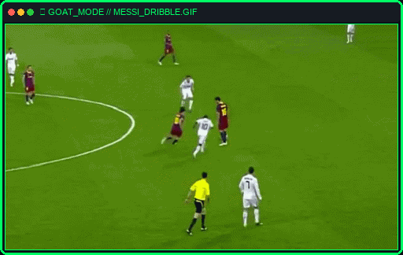

<div align="center">

  <!-- Dynamic Cyber Header Banner -->
  

  <!-- Animated Typing SVG (Properly Encoded) -->
  <a href="https://github.com/MarselPTR">
    
  </a>

  <br/><br/>

  <!-- Live Stats & Profiling Badges -->
  <p align="center">
    <a href="https://github.com/MarselPTR" target="_blank">
      
    </a>
    &nbsp;
    <a href="https://www.linkedin.com/in/marsel-putra-nugraha-b386642b2" target="_blank">
      
    </a>
    &nbsp;
    <a href="https://www.instagram.com/mrslngrr_/" target="_blank">
      
    </a>
    &nbsp;
    
  </p>

  <br/>

  <!-- Animated Messi / Football Player Showcase -->
  <p align="center">
    
  </p>

</div>

---

### 🚀 `<Terminal>` System Briefing `</Terminal>`

```bash
 __________________________________________________________________
| [root@cyberdeck ~]# cat /etc/identity.conf                       |
|==================================================================|
| IDENTITY   : Marsel Putra Nugraha (@MarselPTR)                   |
| ROLE       : Polyglot Software Architect & Security Specialist   |
| FOCUS      : Offensive Security, Pentesting, Reverse Engineering |
| STACK      : C/C++, Rust, Go, Python, TypeScript, Bash, Assembly |
| STATUS     : 🟢 Active & Available for Security Audits & Collabs |
|__________________________________________________________________|
```

---

### 🛡️ Cybersecurity & Offensive / Defensive Arsenal

<table>
  <tr>
    <td width="30%" align="center"><b>Security Domain</b></td>
    <td width="70%" align="center"><b>Tools, Frameworks & Concepts</b></td>
  </tr>
  <tr>
    <td><b>🔍 Web & API Pentesting</b></td>
    <td>
      
      
      
      
      
    </td>
  </tr>
  <tr>
    <td><b>📡 Network & Infrastructure</b></td>
    <td>
      
      
      
      
      
    </td>
  </tr>
  <tr>
    <td><b>⚙️ Binary Analysis & Reverse Eng</b></td>
    <td>
      
      
      
      
      
    </td>
  </tr>
  <tr>
    <td><b>🔐 Blue Team & DevSecOps</b></td>
    <td>
      
      
      
      
      
    </td>
  </tr>
  <tr>
    <td><b>🐧 Dedicated Security OS</b></td>
    <td>
      
      
      
      
    </td>
  </tr>
</table>

---

### 💻 Polyglot Programming Arsenal

<div align="center">
  <p align="center">
    <a href="https://skillicons.dev">
      
    </a>
  </p>
</div>

<details>
<summary><b>🔥 Click to expand detailed stack breakdown</b></summary>

<br/>

- **Languages:** C, C++, Rust, Go, Python, TypeScript, JavaScript, Bash, Assembly (x86_64), Java, PHP, C#, Ruby, SQL
- **Frameworks & Libs:** React, Next.js, FastAPI, Django, Express.js, Node.js, Tailwind CSS
- **Databases & Cache:** PostgreSQL, MongoDB, Redis, MySQL, SQLite, Neo4j
- **DevOps & Cloud:** Docker, Kubernetes, Linux (Kernel / Sysadmin), AWS, GitHub Actions, Nginx, CI/CD
- **Security Methodologies:** OWASP Top 10, MITRE ATT&CK, NIST CSF, Secure Code Review, Threat Modeling

</details>

---

### 📊 Threat & Activity Analytics

<div align="center">

  <!-- GitHub Live Streak Tracker -->
  <a href="https://github.com/MarselPTR">
    
  </a>

  <br/><br/>

  <!-- GitHub Summary & Languages Card -->
  <a href="https://github.com/MarselPTR">
    
  </a>
  &nbsp;
  <a href="https://github.com/MarselPTR">
    
  </a>

</div>

---

### ⚡ Featured Security & Development Focus

| Domain | Focus & Specialization | Tech & Tools |
| :--- | :--- | :--- |
| 🛡️ **Penetration Testing & AppSec** | Web & API security auditing, vulnerability assessment & exploit analysis | `Burp Suite` `OWASP` `Postman` |
| 🔍 **Security Tooling & Automation** | Custom recon automation, threat hunting & custom security scripts | `Python` `Go` `Bash` `Rust` |
| 🔐 **Secure Software Engineering** | High-performance backend architectures with zero-trust & cryptographic security | `TypeScript` `FastAPI` `PostgreSQL` |
| 🧬 **Binary & Malware Analysis** | Reverse engineering executables, analyzing disassembly & API hooks | `C/C++` `Ghidra` `GDB` `x64dbg` |

---

### 💬 Security Mindset

<div align="center">

> *"There are two types of companies: those that have been hacked, and those that don't know they have been hacked yet."*  
> — **Kevin Mitnick**

<br/>

<!-- Dynamic Footer Wave -->


</div>
